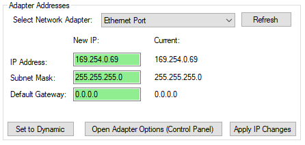
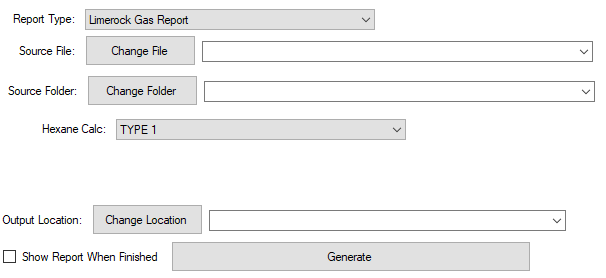
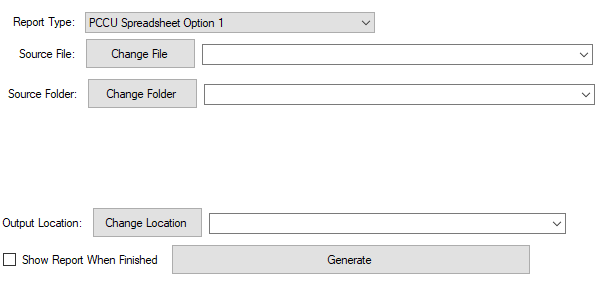
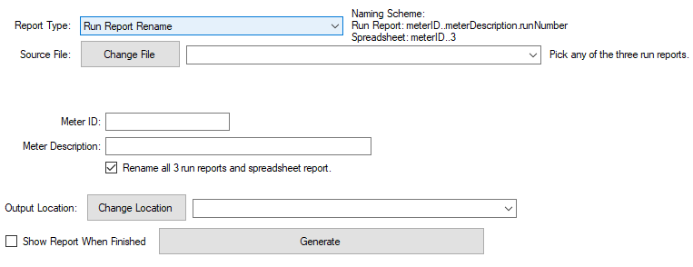
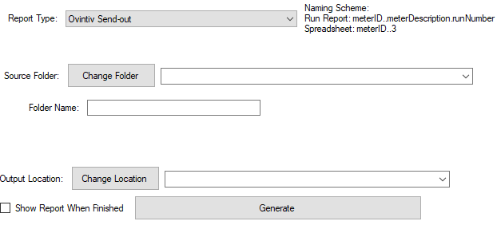
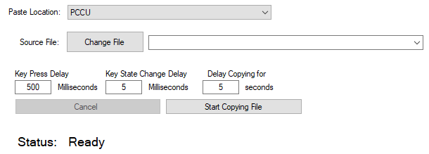
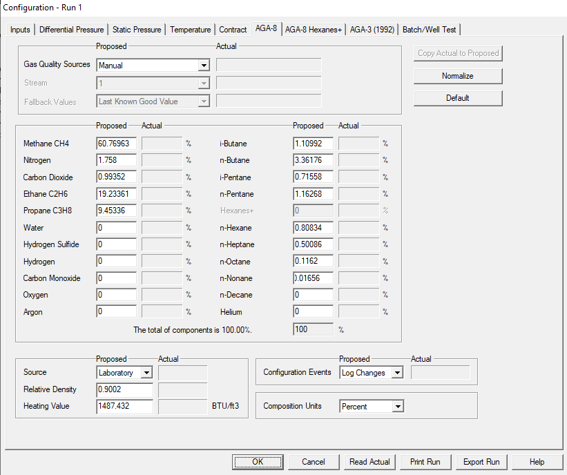
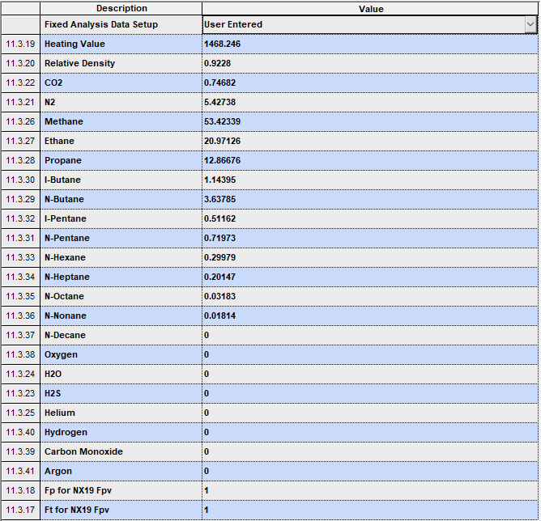

# ExcelPaster
All-in-one software to easily facilitate and automate common tasks in the fields of automation and measurement.

---
## Table of Contents
* [Features](https://github.com/joneslinger/ExcelPaster#features)
* [Compatibility](https://github.com/joneslinger/ExcelPaster#compatibility)
* [Installation](https://github.com/joneslinger/ExcelPaster#installation)
* [How-to](https://github.com/joneslinger/ExcelPaster#how-to)
  * Change IP Address
  * File Generator
    * Limerock
    * Spreadsheet
    * Rename
    * Ovintiv Send Out
  * Copy and Paste
    * PCCU
    * Realflo
    * XMV
    * ModWorx
* [Development Notes](https://github.com/joneslinger/ExcelPaster#development-notes)
  * To-Do
* [Credits](https://github.com/joneslinger/ExcelPaster#credits)
* [License](https://github.com/joneslinger/ExcelPaster#License)

---
### Features
---
<p style="text-decoration: underline; font-size: 125%">Networking</p>

The IP Editor tab allows you to quickly change the IP settings of all your network adapters. 
This tab also includes options to add to and search through a database of IP addresses stored as a csv. You can also ping addresses from the database.
In the future, the database feature may be removed and replaced with a simple IP ping/scan option.

<p style="text-decoration: underline; font-size: 125%">Copy and Paste</p>

The Copy&Paste tab automates data transfer from a file to another file or program.
You can make currently CSVs to easily edit and paste large numbers of cells in PCCU or greatly speed up the entry of gas analysis data into flow meters.
Various file and program types can be easily added in the future. 

<p style="text-decoration: underline; font-size: 125%">Report Generation</p>

The File Generator tab can convert/edit data from one document into another.
You can generate company-specific pdf reports from PCCU run reports, create spreadsheet versions of run reports, change data within one or multiple reports, and even package files for how specific companies like them sent. 
Currently, only GC-focused options exist, but any file generation can be easily added. 

---
### Compatibility
---
Currently, this software will only run on 64-bit Windows. 
We are looking into providing an update to allow for 32-bit Windows.
Development on Linux and MacOS is never expected. 

---
### Installation
---
1. Download the .zip of the latest release of [Interception.](https://github.com/oblitum/Interception/releases/latest)
2. Extract the .zip, and navigate to the "command line installer" folder within the extracted folder.
3. Shift + Right Click in the folder and click "Open Powershell window here"
4. Run the following command in Powershell
```powershell
.\install-interception.exe /install
```
5. Restart after install
6. Download the .zip of the latest release of [ExcelPaster](https://github.com/joneslinger/ExcelPaster/releases/latest)
7. Extract the .zip and place the extracted folder wherever you'd like to keep the program
8. To run, open "ExcelPaster.exe" 


---
### How-To
---


<p style="text-decoration: underline; font-size: 150%">Change IP Address</p>



1. Select the adapter you want to edit the IP (Ethernet port or WiFi card).
2. Enter your desired static IP address, subnet, and gateway.
3. Click the "Apply IP" button.
4. If you wish to have your IP automatically assigned, click the "Set to Dynamic" button.

The "Refresh" button will read the current IP settings for the chosen adapter.


<p style="text-decoration: underline; font-size: 150%">File Generator</p>

Note: "run reports" and "spreadsheet" as used in these instructions refer to the analysis files generated by PCCU when performing a portable GC sample.

<p style="text-decoration: underline; font-size: 125%">Limerock</p>

This generation option creates a standardized pdf gas analysis report for Limerock.



1. Select "Limerock Gas Report" as the Report Type from the dropdown.
2. Select the run report file, or directory of run report files, you wish to make into pdf Limerock reports.
3. Choose the type of hexane calculation done in the report (whether it is a C6 or C9 GC).
4. Choose an output location. By default, it is the same directory as your source file/folder. 
4. Select whether you want the report(s) to open after created, and click generate. 


<p style="text-decoration: underline; font-size: 125%">Spreadsheet</p>

This generation option creates a .TXT spreadsheet file following PCCU's spreadsheet option 1. This spreadsheet is required by Ovintiv for the third run. 



1. Select "PCCU Spreadsheet Option 1" as the Report Type from the dropdown. 
2. Select the run report file, or directory of run report files, you wish to turn into spreadsheet form.
3. Choose an output location. By default, it is the same directory as your source file/folder.
4. Select whether you want the spreadsheet(s) to open after created, and click generate.

<p style="text-decoration: underline; font-size: 125%">Rename</p>

This generation option creates an identical run report with the meter ID and description changed to what you specify. 



1. Select "Run Report Rename" from the dropdown of report types.
2. Select the run report file you wish to rename.
3. Enter a new meter ID and meter description.
4. Check if you want to rename all three runs and the spreadsheet, or uncheck if you want to only rename the selected file. 
5. Choose an output location. By default, it is the same directory as your source file.
6. Select whether you want the new report(s)/spreadsheet to open after created, and click generate. 

<p style="text-decoration: underline; font-size: 125%">Ovintiv Send Out</p>

This generation option packages multiple run reports/spreadsheets into Ovintiv's desired directory format and zips the resulting folders for email.
Additionally, it creates a .csv that lists the meters included in the send-out and a zipped folder containing all the run reports/spreadsheets in one directory. 



1. Select "Ovintiv Send-out" from the dropdown of report types.
3. Select a folder containing all the run reports and spreadsheets to send out without any sub-folders.
3. Enter a folder name. The program will automatically add a "Run Reports" and "Spreadsheets" suffix.
4. Choose an output location. By default, it is the same directory as your source folder. 
5. Select whether you want the .csv to open after created, and click generate.

<p style="text-decoration: underline; font-size: 150%">Copy and Paste</p>

Note: "run reports" and "spreadsheet" as used in these instructions refer to the analysis files generated by PCCU when performing a portable GC sample.


<p style="text-decoration: underline; font-size: 125%">PCCU</p>

For copying into PCCU, you must create a .csv with the same cell setup as the application you wish to copy to.
1. Select PCCU as the report type.
2. Select the .csv file you created to paste into PCCU.
3. Click the "start copying file" button in ExcelPaster.
4. Before the copy countdown ends, select all the text in the first cell to be written to and hit backspace, leaving the cursor in the cell.
5. At the end of the countdown, ExcelPaster will fill in PCCU with the data in the same order as the .csv. Do not hit any keys or click out of the program.


<p style="text-decoration: underline; font-size: 125%">Realflo</p>



1. Select Realflo as the paste location.
2. Select the run report file you wish to copy into Realflo.
3. Enter a key press delay, key state change delay, and copy delay. The default of 500ms, 5ms, and 5s should work fine.
4. Click the "start copying file" button in ExcelPaster.
5. Before the copy countdown ends, select all the text in the methane textbox in Realflo and hit backspace, leaving the cursor in the textbox.
6. At the end of the countdown, ExcelPaster will fill all the analysis data into Realflo. Do not hit any keys or click out of the program.

<p style="text-decoration: underline; font-size: 125%">XMV</p>



1. Select Totalflow New or Old AGA3 as the paste location. New refers to AGA3 app version 2101305-006 and later. Old refers to AGA3 app version 2101305-005 or earlier.
2. Select the run report file you wish to copy into the AGA3 app.
3. Enter a key press delay, key state change delay, and copy delay. The default of 500ms, 5ms, and 5s should work fine.
4. Click the "start copying file" button in ExcelPaster.
5. Before the copy countdown ends, select all the text in the Heating Value entry and hit backspace, leaving the cursor in the cell.
6. At the end of the countdown, ExcelPaster will fill all the analysis data into the AGA app. Do not hit any keys or click out of the program.

<p style="text-decoration: underline; font-size: 125%">Modworx</p>


1. Select Modworx for either Ovintiv or Rimrock as the paste location. The difference between the two companies is certainly a difference in firmware, but the respective firmware versions are not yet known.
2. Select the run report file you wish to copy into Modworx.
3. Enter a key press delay, key state change delay, and copy delay. The default of 500ms, 5ms, and 5s should work fine. 
4. Double-click Carbon Dioxide in Modworx, opening the edit window, and click the "start copying file" button in ExcelPaster.
5. Before the copy countdown ends, select all the text in the CO2 edit window's textbox and hit backspace, leaving the cursor in the textbox.
6. At the end of the countdown, ExcelPaster will fill all the analysis data into Modworx. Do not hit any keys or click out of the program.

---
### Development Notes
---

#### To-Do
* [ ] Add Copy&Paste Photos
* [ ] Add Time Tracking
* [ ] Add Sampling list/recording
* [ ] Add Angry IP Functionality
* [ ] Fix Modbus Test
  * [ ] Crashes with only polling one register
  * [ ] Doesn't remember configuration
  * [ ] No Connection status shown
* [ ] Develop for 32bit
* [x] Finish Initial Readme
* [x] Fix Inability to Copy&Paste Gas Analysis without pressure/temp

### Credits
| Name | Role |
|-|-|
| baaron4 | Owner |
| joneslinger | Contributor |
### License
*No Info*
